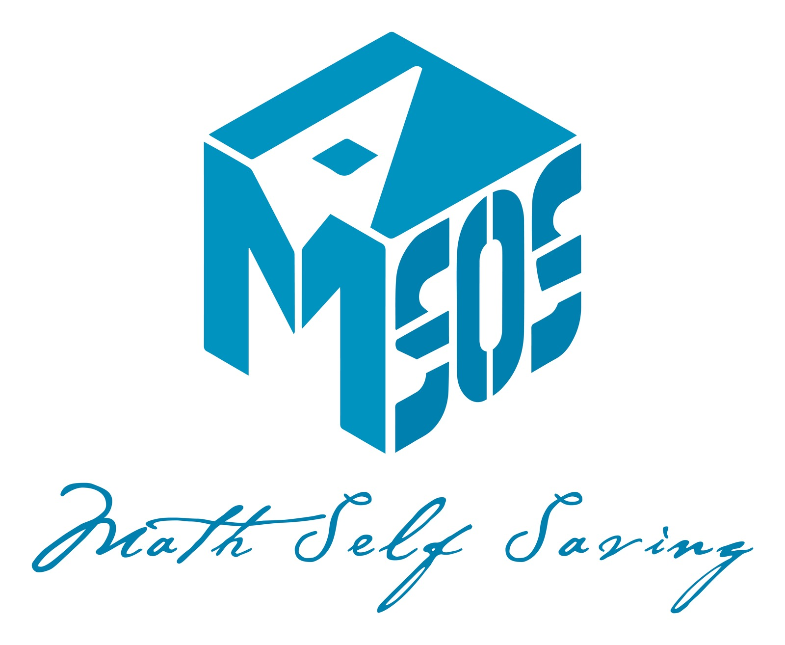

  

# Welcome to the era of Artificial Intelligence

2022年10月30日，Chatgpt横空出世，我们一边惊叹于大语言模型或许可以使得AGI降临成为可能，一边”嘲笑“当时大语言模型的智能水平。短短三年，从GPT3.5到GPT4o到DeepseekR1，再到Claude Opus 4.6以及GPT5.6-sol，再到目前openai的内部模型。大语言模型的智能水平，尤其是coding和math水平得到了空前的提升。2026年5月，openai宣布单位距离猜想告破；7月，anthropic研究院levent在观看世界杯时借助claude fable5证伪三维Jacobi猜想；9月9号，千禧年七大难题之一的NS方程问题被openai的内部模型在启用了数万个agent并行推理后宣布破解。9月11日，陶哲轩、邓煜、舒尔茨等大数学家在mathandai.org上发表《人工智能在数学中的严重错位》引爆全网讨论。形式化验证、人类理解、学术权威、产业激励的矛盾在此时进行了一场集中爆发。而在风暴之外，其他的普通的数学学生又将何去何从呢。
<!-- TODO: 在这里补充“数院自救指南”的首页内容。 -->
